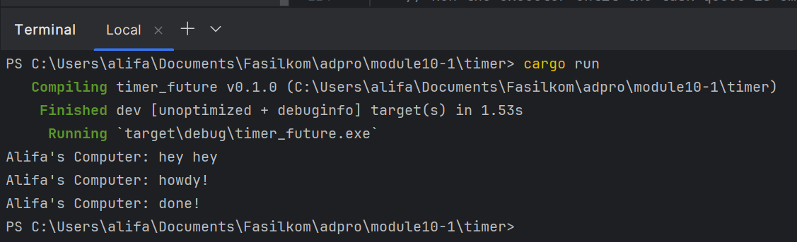

### Result of Execution 

"hey hey" di-print sebelum "howdy!" dan "done!" karena function `main` akan menjalankan perintah print "hey hey" dan 
akan dilanjutkan dengan print "howdy!" dan "done!" yang ada pada queue di executor.