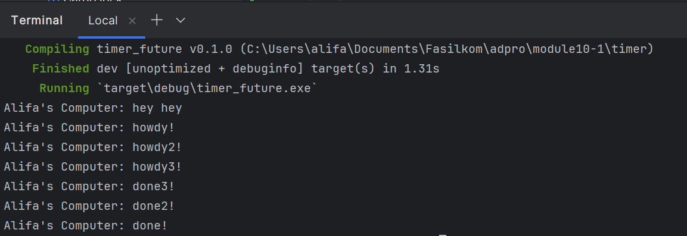
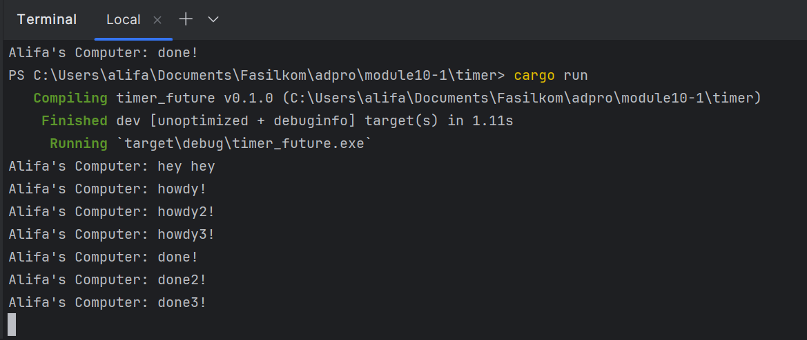

### Result of Execution 

"hey hey" di-print sebelum "howdy!" dan "done!" karena function `main` akan menjalankan perintah print "hey hey" dan 
akan dilanjutkan dengan print "howdy!" dan "done!" yang ada pada queue di executor.

### Replicate spawn

### Removing drop(spawner)

Ketika kita tidak menggunakan `drop(spawner)`, spawner masih tetap hidup dan dapat menerima task baru untuk dijalankan 
oleh executor karena executor hanya berhenti ketika tidak ada task lagi yang tersedia untuk dijalankan, task baru akan 
tetap dijalankan dan tidak menunggu task sebelumnya selesai.

Dengan menggunakan `drop(spawner)`, kita memberitahu executor bahwa tidak akan ada task baru yang akan ditambahkan ke 
dalam antrian. Sehingga, executor berhenti setelah semua task yang sudah ada selesai dijalankan.
